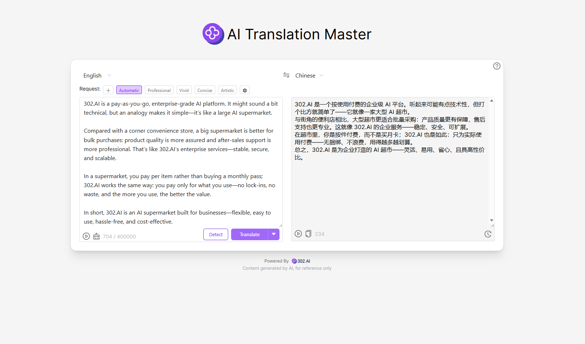

# <p align="center"> 🌐 AI Master Translator 🚀✨</p>

<p align="center">AI Master Translator provides high-quality translation between various languages worldwide through large language models. You can also customize different translation styles, such as professional, lively, concise, artistic, and more. Additionally, it supports features like summarization, polishing, and revision.</p>

<p align="center"><a href="https://302.ai/product/detail/ai-translate-master" target="blank"></a></p >

<p align="center"><a href="README_zh.md">中文</a> | <a href="README.md">English</a> | <a href="README_ja.md">日本語</a></p>


This is the open-source version of the [AI Master Translator](https://302.ai/product/detail/ai-translate-master) from [302.AI](https://302.ai/en/). You can directly log in to 302.AI to use the online version with zero code and zero background, or modify and deploy it yourself according to your requirements.

## Interface Preview
High-quality translation between various languages worldwide powered by large language models. Also offers auxiliary functions such as summarization, polishing, and revision, and allows customization of different translation styles.
 

## Project Features
### 🌐 Global Multilingual Coverage
Supports high-quality translation among the world's major languages, meeting various cross-language scenarios.
### ✨ Diverse Translation Styles
Freely choose from various translation styles such as professional, lively, concise, artistic, and more, with continuous expansion.
### 📝 Intelligent Text Assistance
Built-in intelligent features for summarization, polishing, and revision, improving text quality.
### ⚡ Lightning-fast Experience
Minimalist interface and convenient operation, allowing you to instantly enjoy efficient AI translation.
### 📜 History and Management
Automatically records translation history for easy search, management, and reuse.
### 🌍 Multi-language Interface Support
  - Chinese Interface
  - English Interface
  - 日本語インターフェース

## 🚩 Future Update Plans
- [ ] Add more translation styles and application scenarios (e.g., academic, legal, business, etc.)
- [ ] Enhance text assistance functions (e.g., tone adjustment, summary generation, etc.)

## 🛠️ Tech Stack

- **Framework**: Next.js 14
- **Language**: TypeScript
- **Styling**: TailwindCSS
- **UI Components**: Radix UI
- **State Management**: Jotai
- **Form Handling**: React Hook Form
- **HTTP Client**: ky
- **i18n**: next-intl
- **Theming**: next-themes
- **Code Standards**: ESLint, Prettier
- **Commit Standards**: Husky, Commitlint

## Development & Deployment
1. Clone the project
```bash
git clone https://github.com/302ai/302_ai_translater
cd 302_ai_translater
```

2. Install dependencies
```bash
pnpm install
```

3. Configure environment
```bash
cp .env.example .env.local
```
Modify the environment variables in `.env.local` as needed.

4. Start development server
```bash
pnpm dev
```

5. Build for production
```bash
pnpm build
pnpm start
```

## ✨ About 302.AI ✨
[302.AI](https://302.ai/en/) is an enterprise-oriented AI application platform that offers pay-as-you-go services, ready-to-use solutions, and an open-source ecosystem.✨
1. 🧠 Comprehensive AI capabilities: Incorporates the latest in language, image, audio, and video models from leading AI brands.
2. 🚀 Advanced application development: We build genuine AI products, not just simple chatbots.
3. 💰 No monthly fees: All features are pay-per-use, fully accessible, ensuring low entry barriers with high potential.
4. 🛠 Powerful admin dashboard: Designed for teams and SMEs - managed by one, used by many.
5. 🔗 API access for all AI features: All tools are open-source and customizable (in progress).
6. 💡 Powerful development team: Launching 2-3 new applications weekly with daily product updates. Interested developers are welcome to contact us.