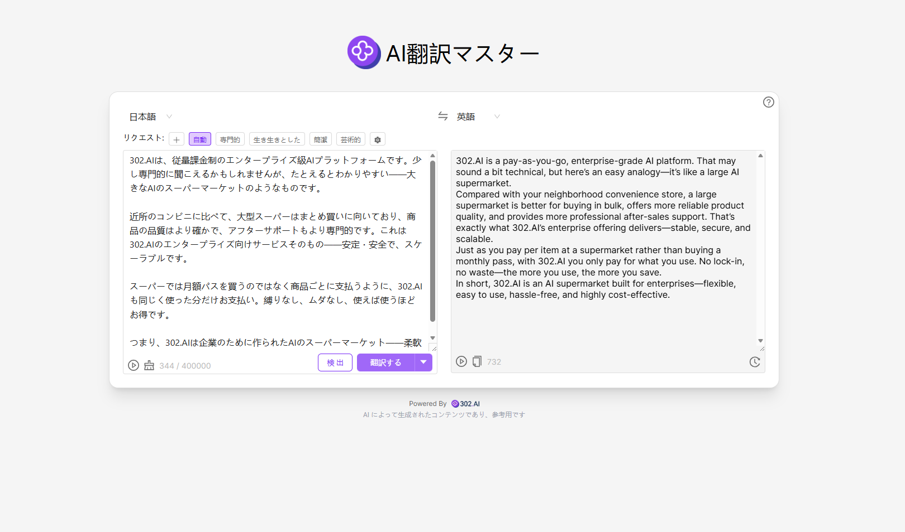

# <p align="center"> 🌐 AI翻訳マスター 🚀✨</p>

<p align="center">AI翻訳マスターは、大規模言語モデルを活用し、世界中のさまざまな言語間で高品質な翻訳を行います。さらに、専門的・活発・簡潔・芸術的など、さまざまな翻訳スタイルを自由にカスタマイズでき、要約・校正・修正などの機能もサポートしています。</p>

<p align="center"><a href="https://302.ai/product/detail/ai-translate-master" target="blank"></a></p >

<p align="center"><a href="README_zh.md">中文</a> | <a href="README.md">English</a> | <a href="README_ja.md">日本語</a></p>


[302.AI](https://302.ai/ja/)の[AI翻訳マスター](https://302.ai/product/detail/ai-translate-master)のオープンソース版です。
302.AIに直接ログインすることで、コード不要、設定不要のオンライン体験が可能です。
あるいは、このプロジェクトをニーズに合わせてカスタマイズし、302.AIのAPI KEYを統合して、自身でデプロイすることもできます。

## インターフェースプレビュー
大規模言語モデルによって世界中のさまざまな言語間で高品質な翻訳を実現し、要約・校正・修正などの支援機能も備えています。さらに、さまざまな翻訳スタイルを自由にカスタマイズできます。
                 

## プロジェクトの特徴
### 🌐 世界中の主要言語をカバー
世界中の主要言語間で高品質な相互翻訳をサポートし、さまざまなクロスランゲージのシーンに対応します。
### ✨ 多様な翻訳スタイル
専門的、活発、簡潔、芸術的など、多様な翻訳スタイルを自由に選択でき、今後も継続して拡充します。
### 📝 スマートなテキストアシスト
要約、校正、修正など、さまざまなスマート支援機能が内蔵されており、テキスト品質を向上できます。
### ⚡ 高速な体験
ミニマルなインターフェースとシンプルな操作で、AIによる効率的な翻訳をすぐに体験できます。
### 📜 履歴記録と管理
翻訳履歴を自動的に記録し、検索・管理・再利用が簡単です。
### 🌍 多言語インターフェース対応
  - 中国語インターフェース
  - English Interface
  - 日本語インターフェース

## 🚩 将来のアップデート計画
- [ ] さらに多くの翻訳スタイルや利用シーン（学術・法律・ビジネス等）を追加
- [ ] テキスト支援機能の強化（トーン調整、要約生成など）

## 🛠️ 技術スタック

- **フレームワーク**: Next.js 14
- **言語**: TypeScript
- **スタイリング**: TailwindCSS
- **UIコンポーネント**: Radix UI
- **状態管理**: Jotai
- **フォーム処理**: React Hook Form
- **HTTPクライアント**: ky
- **国際化**: next-intl
- **テーマ**: next-themes
- **コード規約**: ESLint, Prettier
- **コミット規約**: Husky, Commitlint

## 開発&デプロイ
1. プロジェクトのクローン
```bash
git clone https://github.com/302ai/302_ai_translater
cd 302_ai_translater
```

2. 依存関係のインストール
```bash
pnpm install
```

3. 環境設定
```bash
cp .env.example .env.local
```
必要に応じて`.env.local`の環境変数を修正してください。

4. 開発サーバーの起動
```bash
pnpm dev
```

5. プロダクションビルド
```bash
pnpm build
pnpm start
```

## ✨ 302.AIについて ✨
[302.AI](https://302.ai/ja/)は企業向けのAIアプリケーションプラットフォームであり、必要に応じて支払い、すぐに使用できるオープンソースのエコシステムです。✨
1. 🧠 包括的なAI機能：主要AIブランドの最新の言語、画像、音声、ビデオモデルを統合。
2. 🚀 高度なアプリケーション開発：単なるシンプルなチャットボットではなく、本格的なAI製品を構築。
3. 💰 月額料金なし：すべての機能が従量制で、完全にアクセス可能。低い参入障壁と高い可能性を確保。
4. 🛠 強力な管理ダッシュボード：チームやSME向けに設計 - 一人で管理し、多くの人が使用可能。
5. 🔗 すべてのAI機能へのAPIアクセス：すべてのツールはオープンソースでカスタマイズ可能（進行中）。
6. 💪 強力な開発チーム：大規模で高度なスキルを持つ開発者集団。毎週2-3の新しいアプリケーションをリリースし、毎日製品更新を行っています。才能ある開発者の参加を歓迎します。